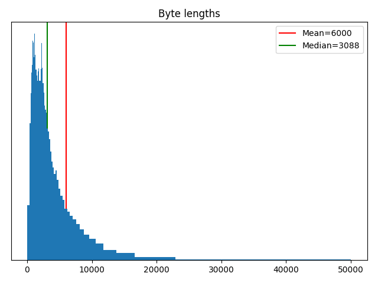
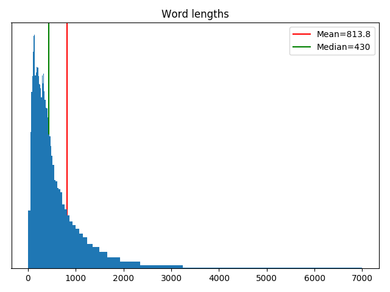
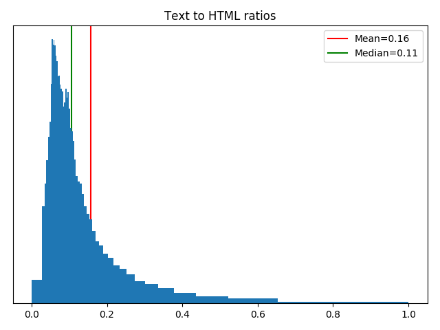

# Отчёт

## Первичная обработка данных

Для чтения XML и выделения ссылок из HTML использовался пакет `lxml`, а для выделения текста из HTML – `html_text`.

Каждая партиция обрабатывалась параллельно. Результаты предобработки были экспортированы в два вида файлов, каждые строчки которых соответствовали документам из исходных партиций и содержали:
* текстовые данные, закодированные в UTF-8 + Base64
* ссылки, закодированные в UTF-8 + Base64 и разделённые символом ','

Предобработка занимает примерно десять минут.

Кодировка текста – Windows-1251. Незнакомые символы считались как 1 байт.

Пробельные символы разбивали текст на слова.

