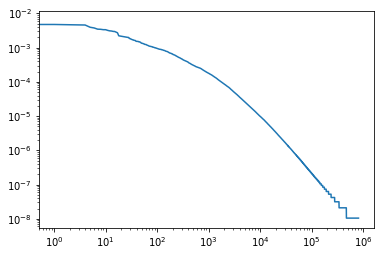
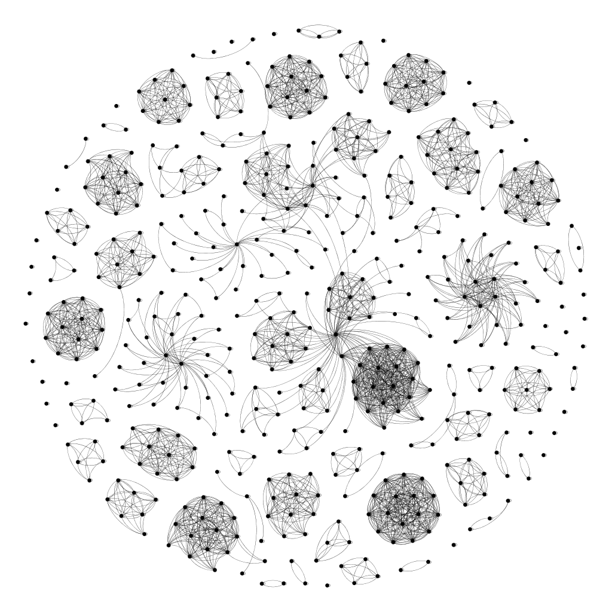
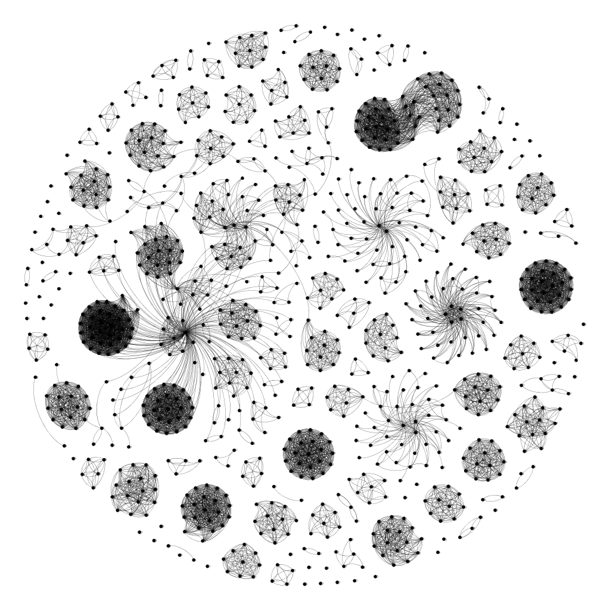

# Отчёт

Станислав Сычев. Соколов Никита. Рябушев Антон

## Первичная обработка данных

Для чтения XML и выделения ссылок из HTML использовался пакет `lxml`, а для выделения текста из HTML – `html_text`.

Каждая партиция обрабатывалась параллельно. Результаты предобработки были экспортированы в два вида файлов, каждые строчки которых соответствовали документам из исходных партиций и содержали:
* текстовые данные, закодированные в UTF-8 + Base64
* ссылки, закодированные в UTF-8 + Base64 и разделённые символом ','

Предобработка занимает примерно десять минут.

Кодировка текста – Windows-1251. Незнакомые символы считались как 1 байт.

Пробельные символы разбивали текст на слова.

# Часть 2. Морфология

Все, что здесь описано, можно увидеть в файле morphological_analysis/01.ipynb

## Обработка

Текст переведен в нижний регистр.

Пропущен через mystem для лемматизации.

С этим связанно несколько эффектов.

Mystem самостоятельно убирает знаки препинания (кроме дефиса).
Слова через дефис остаются как есть (пример юго-западный).
Не совсем понятно, является ли это оптимальным способом, на данный момент решено оставить так. Это и следующие решения в основном принимаются из принципа простоты и лаконичности решения. С дальнейшей возможностью улучшения.

Если слово не знакомо, mystem его не меняет. Самый большой пример, все английские слова остаются неизменны (men man). На данный момент решено оставить в таком состоянии, так как непонятно, нужны ли улучшения в данном аспекте, по какой метрике их считать.

## Some statistics

Никаких дополнительных фильтраций, помимо указанных выше, или действий перед сбором статистики не проводилось.

stop_words: 29703198, normal_words: 122122345, frequency: 0.1956

Средняя длинна слова в словаре: 9.1602. Средняя длинна слова в коллекции: 5.7932

Английским словом считается множество состоящие только из символов английского алфавита.

Английские слова: 26740747, не английские слова: 125084796, frequency: 0.1761

## Обработка

После этого были удаленны все английские слова и стоп слова для большей информативности idf и cf

## Idf top

- 0.46 весь
- 0.56 сайт
- 0.63 главный
- 0.68 новость
- 0.72 поиск
- 0.82 форум
- 0.82 новый
- 0.83 год
- 0.83 беларусь
- 0.84 минск

## Cf top

- 0.00623 сообщение
- 0.00475 г
- 0.00468 весь
- 0.00463 это
- 0.00458 год
- 0.00394 беларусь
- 0.00375 р
- 0.00346 который
- 0.00344 мочь
- 0.00335 форум

## Log log График

## Граф гиперссылок

Помимо ссылок со страницы при первичной обработке находилась ссылка на саму страницу.
Затем с её помощью брались абсолютные ссылки. И после записывались в строку через ',' где первой стоит ссылка на саму страницу.

После по всем партициям были найдены n самых популярных странниц, т.е. страниц с наибольшим числом ссылок на них.
Все остальные странницы выкидывались из рассмотрения и граф ссылок строился только для самых популярных странниц.
Это было сделано т.к. граф для всех 200000 страниц был бы не читаем.
В качестве n было выбрано 500 и 1000.

Как видно многие страницы образуют отдельные компоненты связности, которые соответствуют различным интернет порталам.
