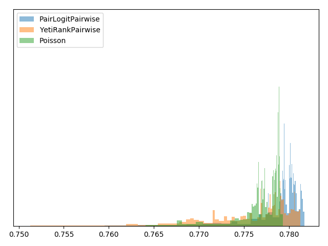

# Машинное обучение ранжированию (LETOR)

## Обучение модели ранжирования на данных [“Интернет-математика 2009”](https://academy.yandex.ru/events/data_analysis/grant2009/)

Данные представляли собой пары запрос-документ с идентификатором запроса, 245 неизвестными численными признаками и значением релевантности этой пары.

Модель обучалась с помощью библиотеки [CatBoost](https://catboost.ai).

Сперва данные были разбиты на три части:
* 45% train, использованные для обучения
* 5% validate, для преждевременной остановки при обучении модели
* 50% holdout, по которым выбиралась лучшая модель

Попробовал семь метрик:
* три поточечные: MAE, Poisson и RMSE
* две pairwise: PairLogit и PairLogitPairwise
* две groupwise: YetiRank и YetiRankPairwise

Значения NDCG@20 обученных моделей, посчитанные на holdout сете:

| Метрика, по которой обучалась модель | Среднее | Медиана |
|--------------------------------------|---------|---------|
| MAE                                  | 0.773   | 0.771   |
| RMSE                                 | 0.776   | 0.775   |
| Poisson                              | 0.777   | 0.776   |
| PairLogit                            | 0.776   | 0.773   |
| PairLogitPairwise                    | 0.78    | 0.77    |
| YetiRank                             | 0.774   | 0.772   |
| YetiRankPairwise                     | 0.777   | 0.774   |

По результатам на holdout сете была выбрана модель, оптимизирующая метрику PairLogitPairwise.

